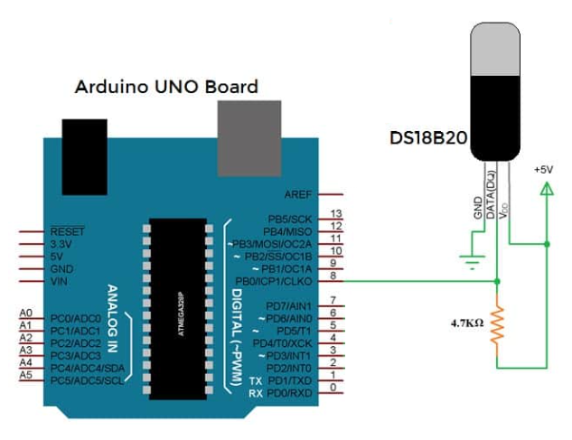

# DS18B20

## Montage

Réaliser le monatge suivant :



# Librairies

Pour utiliser le capteur, il faut importer les librairies `OneWire` et `DallasTemperature`

## Initialisation

Pour initialiser le capteur:

```c
#include <OneWire.h>
#include <DallasTemperature.h>

#define DS18B20 13

OneWire ourWire(DS18B20);
DallasTemperature sensor(&ourWire);
void setup() {
    Serial.begin(9600);
    sensor.begin();
}
```

## Lecture de la température

Pour lire la température :

```c
void loop(){
    sensor.requestTemperatures();
    Serial.println(sensor.getTempCByIndex(0));
}
```