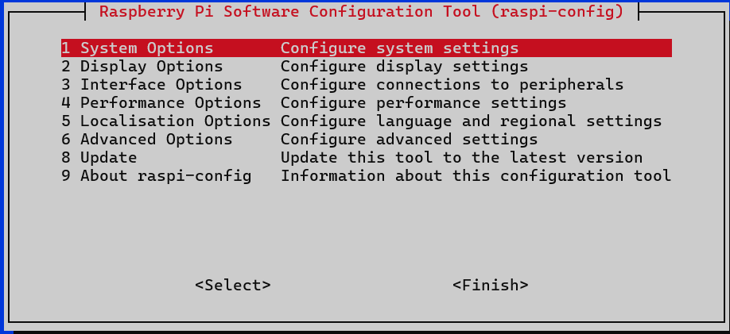
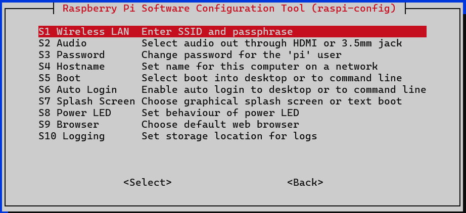

# Connexion manuelle au Wi-Fi

Dans le cas où il faudrait connecter manuellement un raspberry pi au Wi-Fi.

1. Exécuter la commande `sudo raspi-config`
2. Sélectionner l'option : `1 System Options` (déplacement avec les flèches puis sélection avec entrée)

3. Puis sélectionner : `S1 Wireless LAN`

4. Entrer le SSID puis le mot de passe.